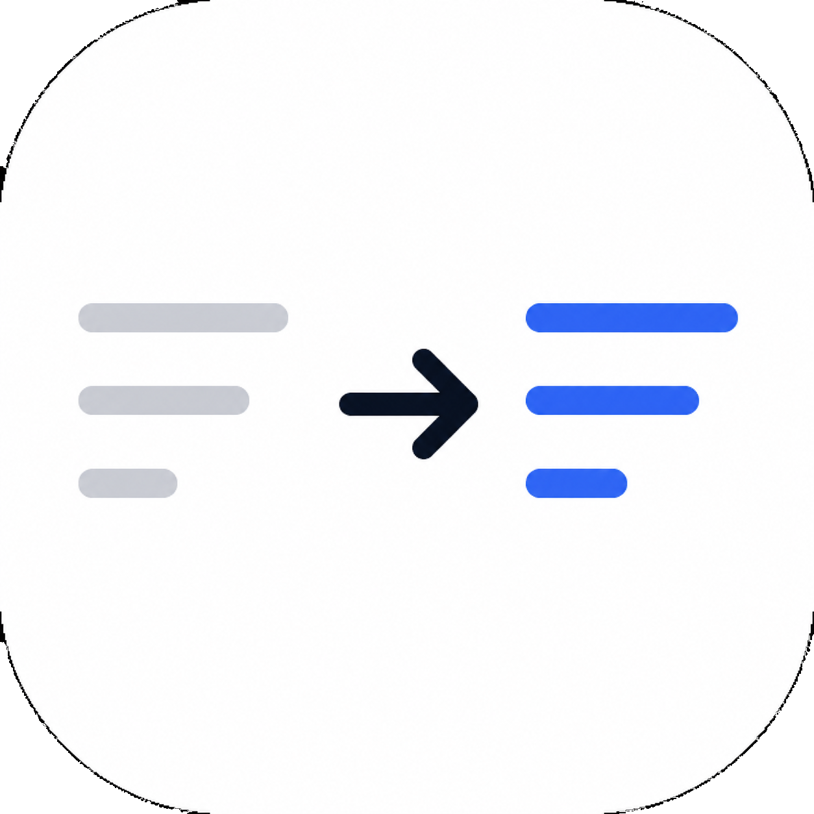

<p align="center">
  
</p>

# Rewrite-Enhanced Autoregressive Decomposition (READ)
`READEvaluator` is an Android app for evaluating on-device GGUF language models on a structured tool-calling task.

The app runs the full inference loop locally on the phone, reads evaluation cases from a TSV file, measures latency and token statistics inside the app, and exports reproducible batch results.

## Task

The repository focuses on a dialogue-grounded tool selection task.

Given:

- a conversation history
- a user query
- a candidate tool list

the model must produce the correct tool plan and arguments.

The app currently supports two task modes:

- `Baseline`: predicts compact JSON with `plan` and `arguments`
- `READ`: one-shot reasoning that predicts `rewrited_query`, `plan`, and `arguments`

For evaluation, both modes are scored the same way:

- exact match on `plan`
- exact match on `arguments`


## What The App Supports

- Import and run local `GGUF` models on Android
- Evaluate models fully on-device without a server
- Switch between `Baseline` and `READ` task flows
- Use bundled or custom TSV test cases
- Preview the final rendered prompt before running a batch
- Run TSV-driven batch evaluation over selected subsets or the full file
- Resume interrupted batch runs
- Export per-case results as TSV and run summaries as JSON

## Metrics In The App

The app records runtime metrics during inference and exposes them in the UI and export files.

Single-run metrics include:

- prompt length
- generated tokens
- prefill time
- generation time
- total time
- prefill speed
- decode speed
- context length used

Batch summary metrics include:

- macro accuracy
- average tokens as `Tokens (Prefill / Decode)`
- average `Prefill (tok/s)`
- average `Decode (tok/s)`
- average prefill and generation latency
- total generated tokens

## Data And Prompting

- The default bundled evaluation file is [tc.tsv](app/src/main/assets/tc.tsv)
- Tool metadata is loaded from [simple_api.json](app/src/main/assets/simple_api.json)
- The setup screen lets you inspect the active Qwen prompt used for the selected task

Prompt behavior:

- `Baseline` uses the baseline Qwen tool-calling prompt
- `READ` uses a one-shot Qwen prompt with `rewrited_query`, `plan`, and `arguments`

## Result Files

Batch runs produce:

- per-row TSV results with predictions, correctness flags, token counts, speeds, and latencies
- summary JSON files with aggregate accuracy and metric averages

Exports are written under the app's internal results store managed by [BatchResultExportStore.kt](app/src/main/java/io/shubham0204/smollmandroid/data/BatchResultExportStore.kt).

## Build

From the repo root:

```bash
./gradlew :app:assembleDebug
```

Debug APK:

```bash
app/build/outputs/apk/debug/app-debug.apk
```

Install to a connected Android device:

```bash
./gradlew :app:installDebug
```

## Repo Map

- Android evaluation flow: [app/src/main/java/io/shubham0204/smollmandroid/ui/customapp](app/src/main/java/io/shubham0204/smollmandroid/ui/customapp)
- On-device inference engine: [smollm](smollm)
- Batch result export logic: [BatchResultExportStore.kt](app/src/main/java/io/shubham0204/smollmandroid/data/BatchResultExportStore.kt)

## Docs

- [Custom App Docs Map](docs/custom-app/README.md)
- [Architecture](docs/custom-app/architecture.md)
- [Roadmap](docs/custom-app/roadmap.md)
- [Batch Result Export Spec](docs/custom-app/specs/batch-result-export-spec.md)
- [Runtime Metrics Spec](docs/custom-app/specs/runtime-metrics-spec.md)

## Upstream Base
This project began as a fork of `SmolChat-Android` and now focuses on `READEvaluator`, an Android app for on-device READ/Baseline evaluation.